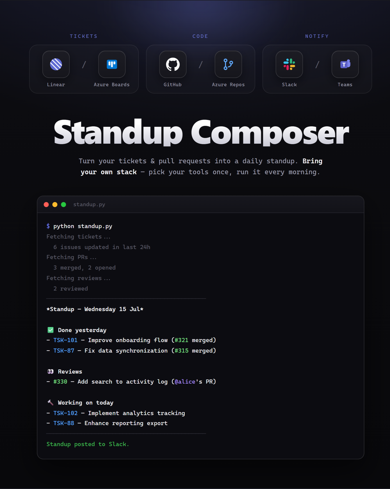

<div align="center">

# Standup Composer

Fetches your tickets & pull requests, composes a daily standup, and posts it (or prints it to your terminal). Bring your own stack.

<p>
  
  
  
  
  
  
</p>



</div>

## What it does

- **Done** — completed tickets + merged PRs
- **Reviews** — PRs you reviewed (not your own)
- **In progress** — started tickets + open PRs
- **Blockers** — tickets with "block" in the title
- **Ticket ↔ PR pairing** — when the ticket ID appears in the PR title or description
- **Monday-aware** — lookback goes back to Friday
- **Pick your stack** — tickets (Linear or Azure DevOps Boards), code (GitHub or Azure DevOps Repos), and notification channel (Slack, Teams, or none) are chosen once at install time, in any combination

## Setup

```bash
git clone https://github.com/0LrNx/standup-composer.git
cd standup-composer
python3 -m venv .venv && source .venv/bin/activate
pip install -r requirements.txt
python install.py
```

`install.py` asks which ticket source, code source, and notification channel you use, and writes the answers to `.env`. Prefer to configure by hand? Copy `.env.example` to `.env` and fill it in yourself — see that file for which variables each provider needs.

```bash
python standup.py
```

**Cron** (weekdays 9am):

```
0 9 * * 1-5 cd /path/to/standup-composer && .venv/bin/python standup.py
```

## Tokens

- **GitHub** — [Settings → Tokens (classic)](https://github.com/settings/tokens), `repo` scope
- **Linear** — [Settings → API](https://linear.app/settings/api) → Personal API keys
- **Azure DevOps** — [Organization settings → Personal access tokens](https://dev.azure.com/), scopes: Work Items (Read) and Code (Read)
- **Slack** — [api.slack.com/apps](https://api.slack.com/apps) → Incoming Webhooks → add to workspace
- **Teams** — add an "Incoming Webhook" connector to your channel, copy its URL

Everything runs locally. Tokens stay in your `.env`.

## Development

```bash
pip install -r requirements-dev.txt
pytest
```

## Credits

Standup Composer builds on [linear-github-standup](https://github.com/y2-znt/linear-github-standup) by [@y2-znt](https://github.com/y2-znt), extending the original Linear + GitHub + Slack tool with pluggable provider stacks (Azure DevOps Boards/Repos, Microsoft Teams) and an interactive installer.
